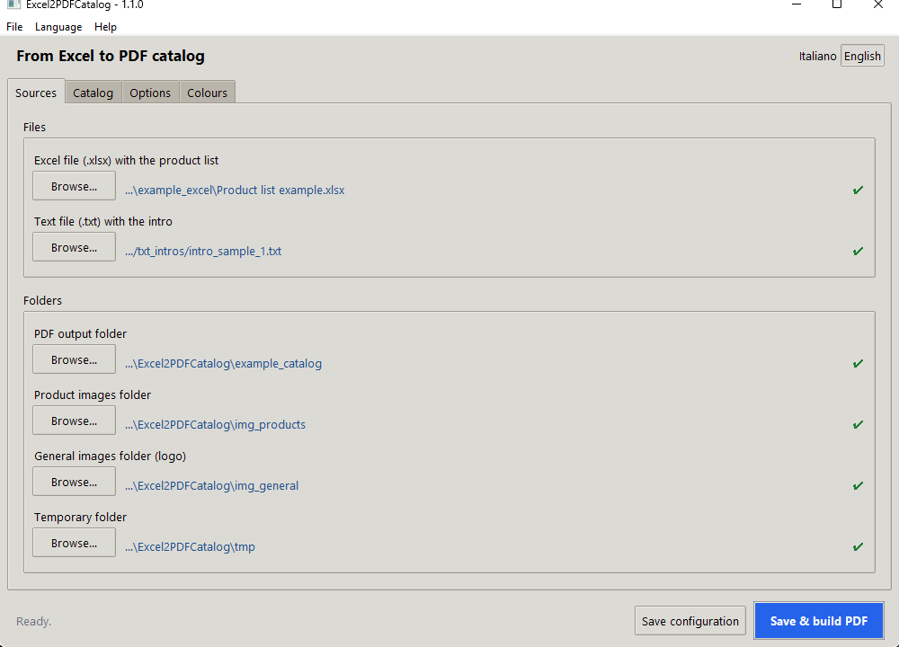
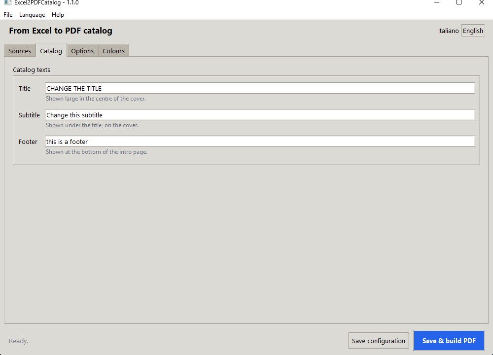
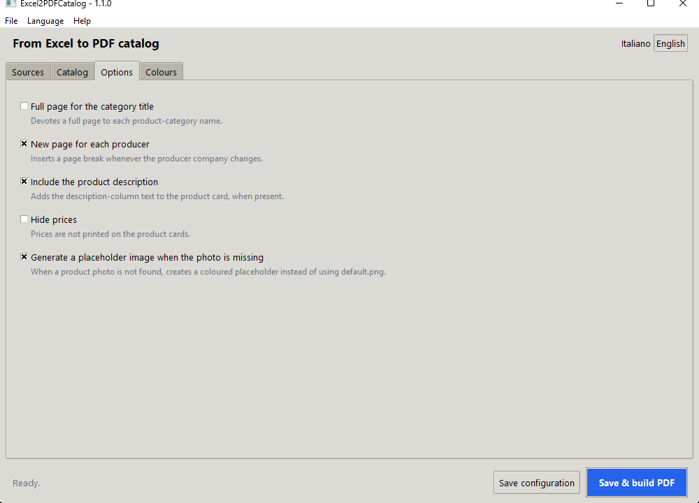
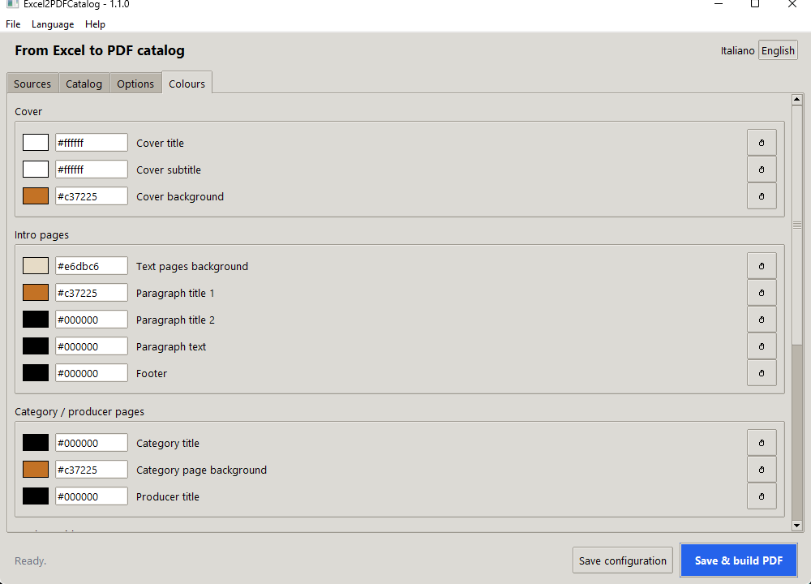

# Excel2PDFCatalog

Excel2PDFCatalog is a Python tool that reads product/catalog data from an Excel file and generates one PDF catalog. It provides a tabbed desktop UI (Tkinter/`ttk`, bilingual Italian/English) to select the Excel file, folders, catalog texts, options and colors, plus a PDF builder that composes pages from rows and linked images.

## Purpose
Excel2PDFCatalog is a lightweight utility designed to **convert Excel spreadsheets into well-formatted PDF catalogs**.  
It is particularly useful for businesses, shops, or individuals who need to quickly generate printable product catalogs from structured Excel data.

## ✨ Key Features
- 📊 **Excel to PDF conversion**: Transform tabular data into a clean, professional PDF layout.
- 🖼️ **Image support**: Include product images referenced in your Excel file.
- 🎨 **Customizable layout**: Adjust fonts, colors, and formatting to match your branding.
- ⚡ **Fast and simple**: Minimal setup required, just point to your Excel file and generate.
- 🌍 **Bilingual UI**: Italian / English, switchable at runtime (choice saved in `config.json`).
- 🛠️ **Cross-platform**: Works on Windows, macOS (Intel and Apple Silicon), and Linux. The UI uses only the Python standard library (`tkinter`/`ttk`) — no extra UI dependency.

## ✨ Other Features
- Excel import: reads Excel files via ***pandas/openpyxl*** with support for common Excel formats and multiple sheets.
- Column-to-field mapping: configurable mapping between Excel columns and product fields (title, description, price, image references).
- UI-driven workflow (tabbed `ttk.Notebook`, in the order you fill it in):
  - **Sources** — Excel file, intro `.txt`, and the output / product-images / general-images / temp folders, each with a ✔ / ✕ *exists* marker.
  - **Catalog** — cover title, subtitle, footer.
  - **Options** — the layout flags, each with a one-line description.
  - **Colors** — grouped by the PDF region they affect; swatch picker + hex field with live validation + per-value reset.
  - A persistent bottom bar with an inline status line and **Save config** / **Save & build PDF** buttons; a language toggle (IT/EN) top-right; the full run log in `logs/app.log`.
- PDF generation:
  - Uses reportlab to layout pages and render text and images.
  - Supports multiple images per product (searches configured image folders).
  - Image resizing and placement logic to fit images into product frames.
- Config files:
  - ***config.json*** — generated UI/runtime state: `language`, title/subtitle/footer, colors, folder paths, boolean flags. Written next to the app when run from source; under the per-user data dir (`~/Library/Application Support/Excel2PDFCatalog`, `%LOCALAPPDATA%\Excel2PDFCatalog`) in packaged builds.
  - ***Excel2PDFCatalog.config*** — project-specific Excel column mapping and layout rules (INI).
- Error handling & logging: console output and log messages for missing images, parsing errors, and generation steps.
- Examples & assets:
  - ***example_excel/*** and ***example_catalog/*** provide sample inputs and outputs to validate layout and mapping.
  - ***assets/icon/*** holds the application / window icon bundled into the builds (`icon.ico` on Windows, `icon.icns` on macOS, `icon_*.png` for the Tk window). It is drawn procedurally — regenerate it with `python assets/icon/make_icon.py` (needs only Pillow, already a dependency).
- Portable & editable: code organized to allow quick changes to layout logic, mapping rules, or PDF styling.

## ⚙️ Tech stack used


## 📦 Download (no Python needed)

Ready-to-run builds are published under [Releases](https://github.com/alexscarcella/Excel2PDFCatalog/releases):

| Your machine | File to download |
|---|---|
| Windows | `Excel2PDFCatalog-Windows-vX.Y.Z.zip` → extract and run the `.exe` |
| Mac with Apple Silicon (M1/M2/M3/M4) | `Excel2PDFCatalog-macOS-AppleSilicon-vX.Y.Z.dmg` |
| Mac with Intel processor | `Excel2PDFCatalog-macOS-Intel-vX.Y.Z.dmg` |

Not sure which Mac you have? Apple menu → *About This Mac*: "Chip Apple M…" means Apple Silicon, "Intel" means Intel.
The two macOS builds are **not** interchangeable: the Apple Silicon build does not run on Intel Macs (Rosetta 2 translates
Intel → Apple Silicon, not the other way around).

On first launch macOS blocks the app because it is not signed with a Developer ID: right-click the app → *Open* → *Open*.

## 🛠️ Requirements (running from source)

- **Python 3.11+** (with the standard-library `tkinter` module — bundled with the python.org installers)
- Dependencies listed in `app/requirements.txt` (notably: reportlab, pillow, pandas, openpyxl). The UI itself needs no extra package.
- Tests need nothing beyond the standard library: `python -m unittest discover -s tests -v`

## 🚀 Installation & Run (Windows)

### 1. Create and activate a virtual environment
```bash
python -m venv .venv
.venv\Scripts\activate
```

### 2. Install dependencies
```bash
pip install -r app/requirements.txt
```

### 3. Run the application
```bash
python Excel2PDFCatalog.py
```

👉 Alternatively, launch directly via VS Code using ``.vscode/launch.json``

## ⚙️ Configuration

``config.json`` → generated UI/runtime state (language, folders, catalog texts, colors, flags). Normally edited through the UI, not by hand.

``Excel2PDFCatalog.config`` → Excel column mapping and layout rules (`MARGIN`, `LOCALE`). Edit this if your spreadsheet uses different column headers.

📂 Project Structure

```text
Excel2PDFCatalog/
├── Excel2PDFCatalog.py        # Entrypoint: load_config() + build_UI_and_GO(); installs sys.excepthook
├── app/
│   ├── config_utils.py        # Runtime state + load_config()/save_config() (config.json)
│   ├── ui_interface.py        # Tabbed ttk UI (build_UI_and_GO)
│   ├── i18n.py                # Bilingual IT/EN strings + language switching
│   ├── build_PDF.py           # PDF generation with ReportLab (build_pdf)
│   ├── images_utils.py        # Image lookup + procedural placeholder generation
│   ├── paths_utils.py         # resource_path() / writable_path() (source vs PyInstaller bundle)
│   ├── logger.py              # Shared rotating-file logger (logs/app.log)
│   └── requirements.txt       # Python dependencies
├── assets/
│   ├── icon/                 # App / window icon: icon.ico, icon.icns, icon_*.png + make_icon.py (regen)
│   └── Preview_Windows_*.png  # Per-tab UI screenshots embedded in this README
├── tests/                    # stdlib unittest suite (config_utils, i18n, build_PDF, images_utils)
├── fonts/                    # Custom TTF font registered by build_PDF.py
├── txt_intros/              # Sample intro text files
├── img_products/            # Product images (name = Excel image column, 1:1)
├── img_general/             # General images (logo.png)
├── example_excel/           # Example input spreadsheet
├── example_catalog/         # Example PDF output
├── config.json             # Generated UI/runtime state (git-ignored)
└── Excel2PDFCatalog.config  # Excel column mapping + layout rules (INI)
```

## ▶️ Usage

The window is organised into tabs, in the order you normally fill them in. The
language selector (top-right) and the bottom action bar are always visible; the
interface is available in **Italian and English**, switchable at runtime (the
choice is saved in `config.json`).

1. Start the app.
2. **Sources / Sorgenti** — pick the Excel file, the intro `.txt` file, and the
   folders (output, product images, general images, temp). A ✔ / ✕ marker next to
   each row tells you whether the path exists.
3. **Catalog / Catalogo** — set the cover title, subtitle and footer.
4. **Options / Opzioni** — toggle the layout flags (each has a one-line
   description).
5. **Colors / Colori** — the colours are grouped by the region of the PDF they
   affect; click a swatch to pick a colour or type a hex value, and use ↺ to
   restore a single default.
6. Click **Save & build PDF / Salva e genera PDF**. If something is missing the
   status bar says what and jumps you back to the Sources tab; otherwise the PDF
   is written to the output folder. Column mapping still lives in
   `Excel2PDFCatalog.config`.

## 📄 Preview

An Excel file with columns Name, Price, Image can produce a PDF catalog with:

- Product title
- Formatted price
- Linked image from img_products/

### UI Preview (Windows)

The tabbed `ttk` interface — Sources / Catalog / Options / Colors — with the
always-visible language toggle (top-right) and the **Save config** / **Save &
build PDF** action bar. File paths in the screenshots are masked.

#### Sources tab



#### Catalog tab



#### Options tab



#### Colors tab



### UI Preview (macOS)

*macOS screenshots will be added once a capture environment is available.*

## 🛠️ Troubleshooting

- Verify that image filenames referenced in Excel match actual files in the provided image folders.
- If an image is missing, the generator logs a warning and continues (placeholder behavior depends on config).
- Reinstall dependencies inside the active virtualenv if import errors occur.
- Check the VS Code terminal/output for full error traces when debugging.
- Logs: `logs/app.log` when run from source; `~/Library/Application Support/Excel2PDFCatalog/logs/app.log` (macOS) or `%LOCALAPPDATA%\Excel2PDFCatalog\logs\app.log` (Windows) for packaged builds. Silent startup crashes in packaged builds are written to `crash.log` / `startup.log` in the same folder.
- To change the UI language, use the IT/EN toggle (top-right) or the **Language / Lingua** menu; the choice is stored in `config.json`.

## 🤝 Contributing

Report bugs or suggest improvements by opening an Issue.
Submit Pull Requests for new features or optimizations.
Improve documentation and examples to help other users.

## 📌 Notes

This project is intended as an internal, editable tool. You can adapt the code and configuration files to fit specific catalog formats or layout requirements.
